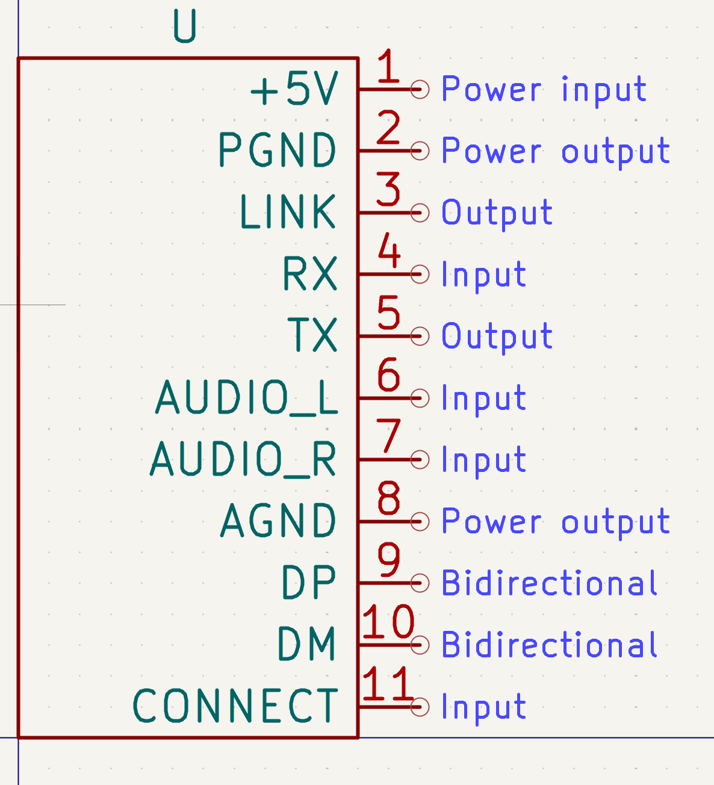
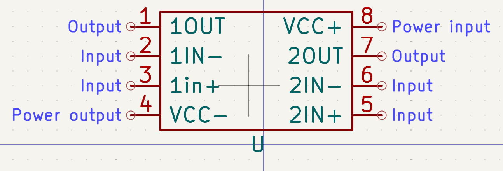
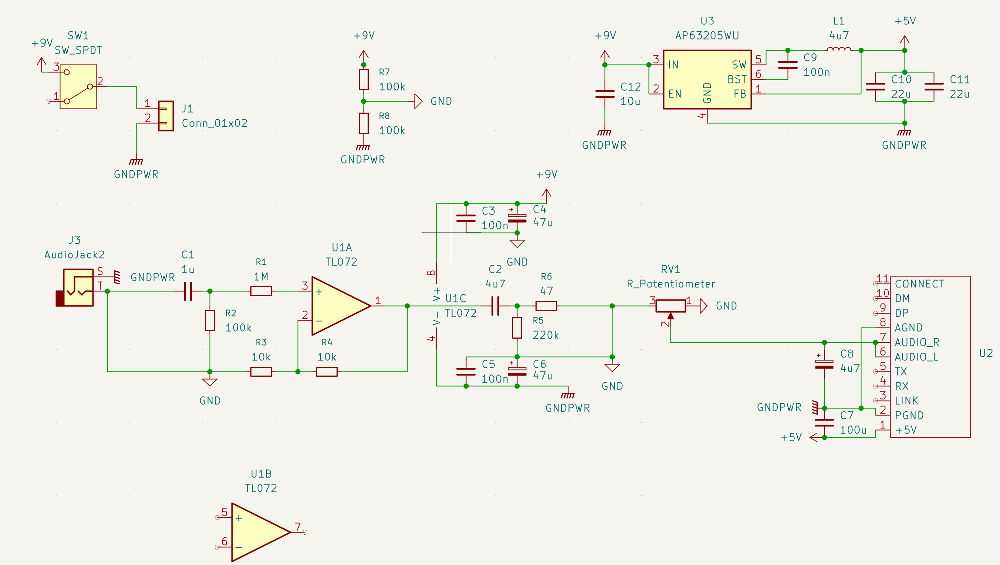
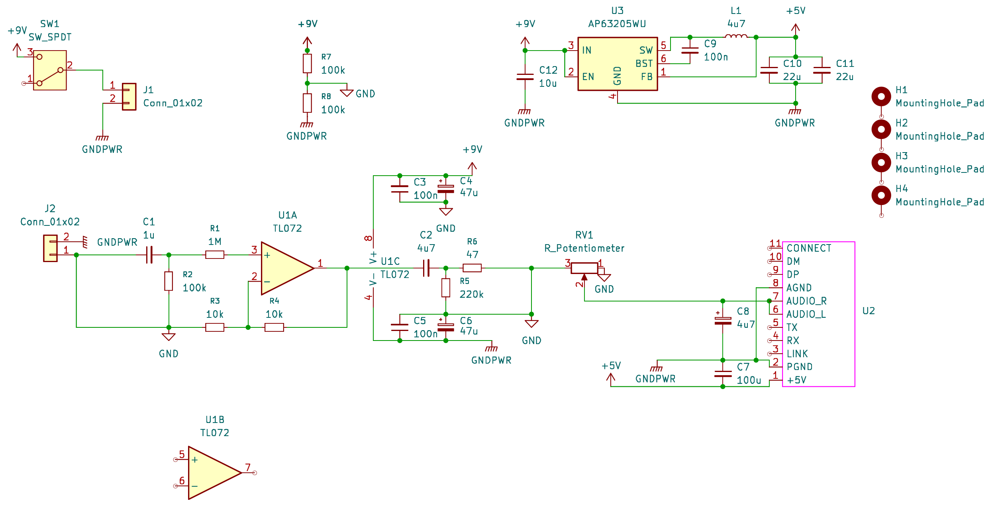
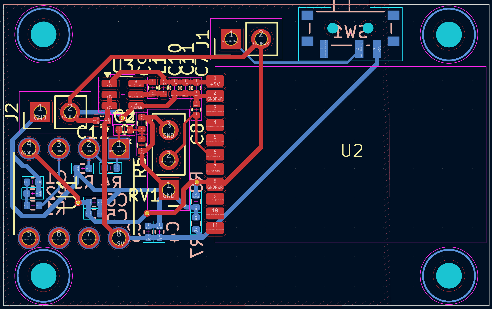
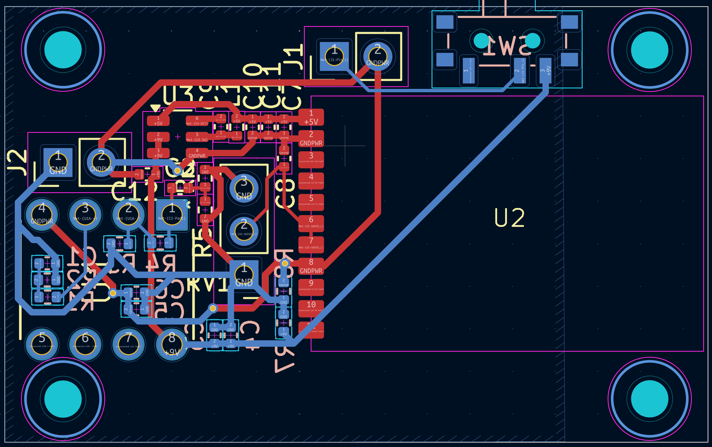

total time (so far): 0 hrs

## 2025-06-17
- Researched how guitar amps work
- Researched components needed for a guitar amp
- Researched how bluetooth works

Time spent: 2 hrs

## 2025-06-18
- Found specific components to use
- Made symbols & footprints for the components
- Started researching how to make an amplifier circuit

Time spent: 3 hrs

## 2025-06-21
- Fixed pin orientation of bluetooth module
- Made v1 of schematic (partial reference design [here](https://2.bp.blogspot.com/-1wqxx-jvaGM/V-nGi2WOsvI/AAAAAAAAA0s/gCCoJ27efYsKQ02fjROY2QzsP2jolWZbACLcB/s1600/HiFi%2BPreAmp%2BCircuit%2BSchematic.jpg))

Time spent: 7 hrs (yeah it was not easy :|)

## 2025-06-21
- Footprints, footprints, footprints
- First draft of PCB (awaiting review)
- Minor edits to schematic

Time spent: 5 hrs
