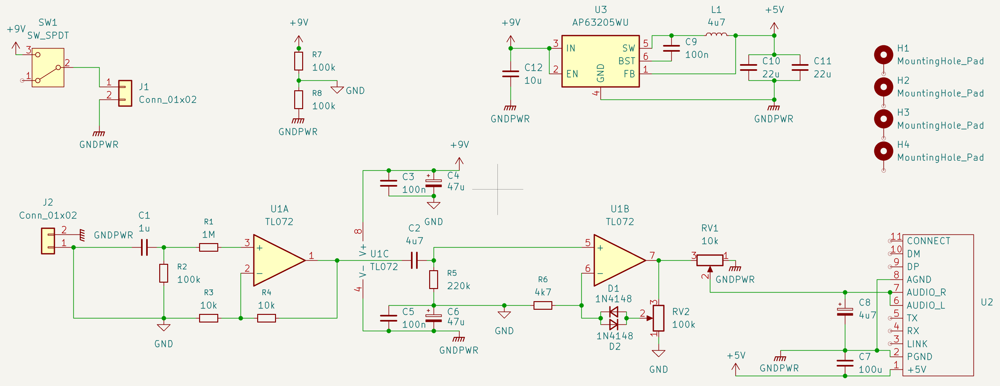
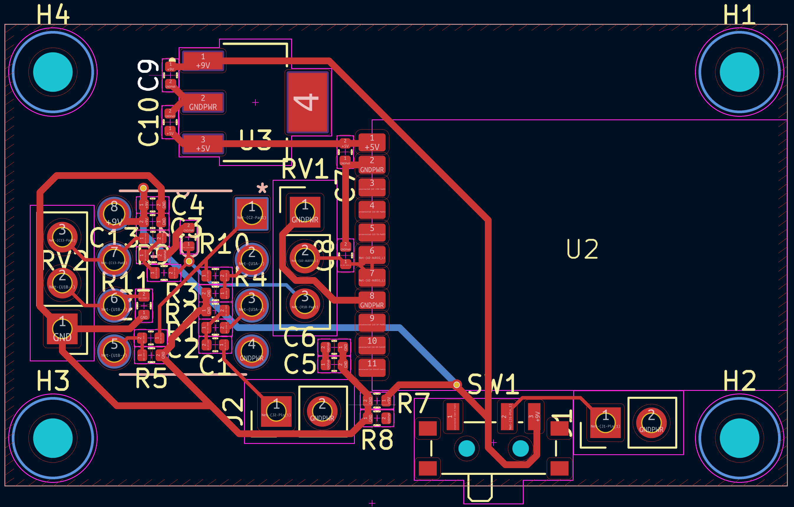
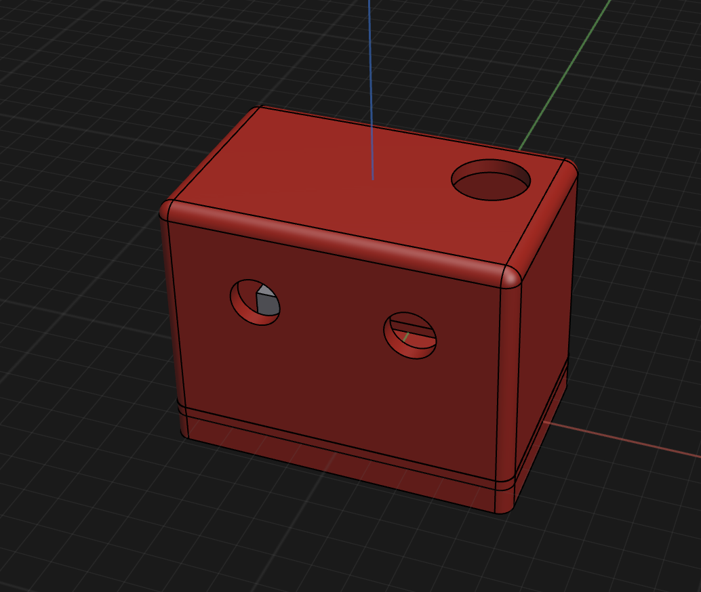

total time (so far): 47.5 hrs

## 2025-06-17
- Researched how guitar amps work
- Researched components needed for a guitar amp
- Researched how bluetooth works

Time spent: 2 hrs

## 2025-06-18
- Found specific components to use
- Made symbols & footprints for the components
- Started researching how to make an amplifier circuit

Time spent: 3 hrs

## 2025-06-21
- Fixed pin orientation of bluetooth module
- Made v1 of schematic (partial reference design [here](https://2.bp.blogspot.com/-1wqxx-jvaGM/V-nGi2WOsvI/AAAAAAAAA0s/gCCoJ27efYsKQ02fjROY2QzsP2jolWZbACLcB/s1600/HiFi%2BPreAmp%2BCircuit%2BSchematic.jpg))

Time spent: 7 hrs (yeah it was not easy :|)

## 2025-06-21
- Footprints, footprints, footprints
- First draft of PCB (awaiting review)
- Minor edits to schematic

Time spent: 5 hrs

## 2025-06-22
- Added distortion circuit
- Started figuring out how SPICE simulations work

Time spent: 4 hrs

## 2025-06-23
- Installed LTSpice
- Built the circuit in LTSpice
- Simulated the circuit
- Tried a lot of different values for the components
- Added an RC filter to the output
- Still not working :|

Time spent: 6 hrs

## 2025-06-24
- Fixed distortion circuit
- Changed pre-amp stage
- Added voltage cap (max ~1.9VPP now)
- Changed to LDO for 9V to 5V conversion
- Rebuilt schematic in KiCad
- Researched some parts
- Added TRRS jack for headphone output

Time spent: 7 hrs

## 2025-06-26 & 2025-06-29
(i went to Sydney for two days and forgot to journal but i came back and locked in)
- Set up Windows LTSpice using Wine
- Small changes to schematic 
- Routed PCB  
- Made case (its so cool that you can import an image, resize it, and trace it to model parts lol) 
- Changed some capacitor footprints to obey the laws of physics 
- Made BOM and selected components from LCSC
- Made logo 
- Added silkscreen art  
- Rendered case 

Time spent: 13 hrs

## 2025-07-02
- Added links to BOM

Time spent: 30 mins
