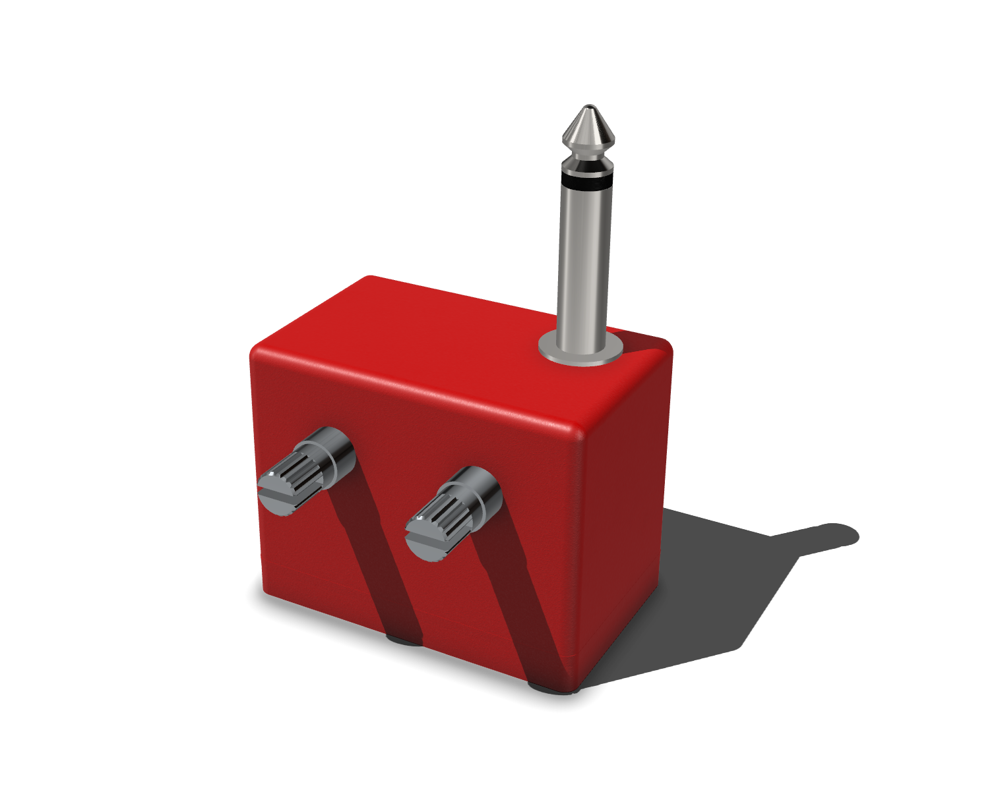

# Volt
A portable guitar amp that works with your bluetooth device, so you can play anywhere, anytime.

## BOM
|Designator    |Footprint         |Quantity|Value       |LCSC Part #|
|--------------|------------------|--------|------------|-----------|
|C1, C13       |0402              |2       |1u          |C14445     |
|C10, C3, C5   |0402              |3       |100n        |C1525      |
|C2, C8        |0402              |2       |4u7         |C23733     |
|C4, C6        |0805              |2       |47u         |C1954938   |
|C7            |1206              |1       |100u        |C883598    |
|C9            |0402              |1       |0.22u       |C16772     |
|R1            |0402              |1       |1k          |C26083     |
|R10, R3       |0402              |2       |4k7         |C25900     |
|R11, R4, R6   |0402              |3       |10k         |C25744     |
|R2, R7, R8, R9|0402              |4       |100k        |C25741     |
|R5            |0402              |1       |220k        |C25767     |
|SW1           |SW_SPDT_PCM12     |1       |SW_SPDT     |C221841    |
|U3            |VREG_LM7805MP_NOPB|1       |LM7805_TO220|C2848241   |

Price: $6.47
### Parts to source yourself
- TL072 op-amp e.g. [this](https://www.aliexpress.com/item/1005006135219871.html?pdp_ext_f=%7B%22sku_id%22%3A%2212000035916831018%22%7D&sourceType=1&spm=a2g0o.wish-manage-home.0.0)
- Bluetooth module e.g. [this](https://www.aliexpress.com/item/1005006761214266.html?pdp_ext_f=%7B%22sku_id%22%3A%2212000042256324472%22%7D&sourceType=1&spm=a2g0o.wish-manage-home.0.0)
- 1/4 inch audio jack (male) e.g. [this](https://www.aliexpress.com/item/1005006199010497.html?pdp_ext_f=%7B%22sku_id%22%3A%2212000036235541089%22%7D&sourceType=1&spm=a2g0o.wish-manage-home.0.0)
- 9V battery & 9V battery connector e.g. [this](https://www.aliexpress.com/item/1005003688602261.html?spm=a2g0o.order_list.order_list_main.23.22431802VuUklR)
- 100k potentiometer (linear) e.g. [this](https://core-electronics.com.au/rotary-potentiometer-100k-ohm-logarithmic-panel-mount.html)
- 100k potentiometer (logarithmic) e.g. [this](https://core-electronics.com.au/rotary-potentiometer-100k-ohm-linear-panel-mount.html)
- 4x M2 screws e.g. [this](https://www.aliexpress.com/item/4000970993800.html?spm=a2g0o.productlist.main.1.58de4aHV4aHVjt&algo_pvid=0fc23f4e-c433-440c-a35c-41e9ab94c65d&algo_exp_id=0fc23f4e-c433-440c-a35c-41e9ab94c65d-0&pdp_ext_f=%7B%22order%22%3A%222927%22%2C%22eval%22%3A%221%22%7D&pdp_npi=4%40dis%21AUD%211.84%211.68%21%21%211.19%211.09%21%402103244617511662003371305ef768%2110000013100721958%21sea%21AU%212685707787%21X&curPageLogUid=a6nSASSgxzOP&utparam-url=scene%3Asearch%7Cquery_from%3A)
- Case (files in `case/`)
- Some wires & solder
- VERY IMPORTANT - tape or something else to shield your soldered connections

Price: $16.57

Total PCB & PCBA Price: $32.51

Total Price: $49.08

**Total Price + est. shipping**: $60.00

(prices converted from AUD to USD, accurate as of 2025-06-29)
